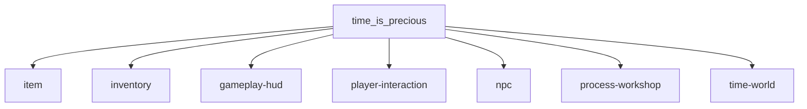
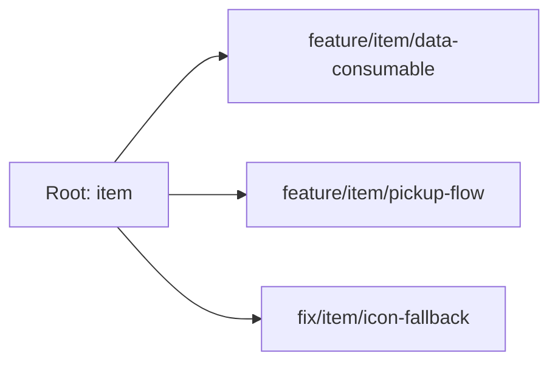

# Root, Branch, dan Visual Tracker

Dokumen ini dipakai untuk membedakan tiga hal:

1. `Root` = domain fitur besar di project.
2. `Branch Git` = pekerjaan kecil yang diambil dari satu root.
3. `Commit scope` = label kecil agar riwayat Git tetap enak dibaca.

Prinsip utamanya: jangan jadikan branch sebagai peta arsitektur utama. Peta arsitektur disimpan di dokumen ini, sedangkan branch dipakai untuk kerja yang pendek dan spesifik.

## Kenapa model ini lebih enak daripada Git Bash saja

- Git Bash bagus untuk melihat histori, tapi kurang nyaman untuk melihat hubungan antar fitur.
- Root map membuatmu bisa melihat "fitur induk -> turunan -> file yang disentuh".
- Branch jadi lebih konsisten karena selalu lahir dari root yang jelas.
- Saat balik ke project setelah beberapa hari, kamu tidak perlu menebak lagi sebuah branch itu milik domain mana.

## Pohon hierarki project saat ini

```text
time_is_precious
|-- item
|   |-- data
|   |   |-- resources/items
|   |   `-- resources/item_data
|   |-- runtime
|   |   |-- scripts/autoload/item_database
|   |   `-- scripts/class/item_enums
|   |-- pickup
|   |   |-- pickup_item.gd
|   |   `-- scenes/pickup_item
|   `-- ui
|       `-- scenes/ui/item_slot
|
|-- inventory
|   |-- runtime
|   |   `-- scripts/autoload/inventory
|   |-- ui
|   |   |-- scenes/ui/inventory_ui
|   |   |-- scenes/ui/item_grid
|   |   `-- scenes/ui/item_slot
|   `-- content-link
|       `-- resources/items
|
|-- gameplay-hud
|   |-- ui
|   |   |-- scenes/ui/gameplay_hud
|   |   |-- scenes/ui/hud_shortcut_slot
|   |   `-- scenes/ui/hud_side_action
|   |-- theme
|   |   `-- resources/ui_gameplay_theme
|   `-- test-scene
|       `-- scenes/test_scenes/test_scene_feature_gameplay_hud
|
|-- player-interaction
|   |-- player
|   |   `-- scenes/player
|   |-- interactable
|   |   |-- scenes/components/interactable_component
|   |   `-- scenes/components/interactable_label_component
|   `-- input
|       `-- scripts/game_input_events
|
|-- npc
|   |-- base
|   |   `-- scenes/npc_base
|   |-- children
|   |   `-- scenes/npc_children
|   `-- data
|       |-- resources/npc_data
|       `-- resources/npc_states
|
|-- process-workshop
|   |-- process
|   |   |-- scripts/autoload/process_manager
|   |   `-- resources/process_data
|   |-- work
|   |   |-- scripts/autoload/work_manager
|   |   |-- scripts/class/work_order
|   |   `-- scripts/class/station_state
|   `-- workshop
|       |-- scenes/work_shop
|       `-- scripts/autoload/work_shop_storage
|
`-- time-world
    |-- time
    |   |-- scripts/autoload/time_component_manager
    |   `-- scenes/time_label
    `-- world-test
        `-- scenes/test_scenes
```

## Diagram ringkas root



## Root yang paling relevan untuk pekerjaanmu sekarang

| Root | Tujuan | File/folder utama | Contoh child branch |
| --- | --- | --- | --- |
| `item` | definisi item, icon, category, pickup, data item | `resources/items`, `resources/item_data`, `scripts/autoload/item_database`, `scenes/pickup_item`, `scenes/ui/item_slot`, `pickup_item.gd` | `feature/item/data-consumable` |
| `inventory` | penyimpanan item, kapasitas, grid, buka/tutup inventory | `scripts/autoload/inventory`, `scenes/ui/inventory_ui`, `scenes/ui/item_grid`, `scenes/ui/item_slot` | `feature/inventory/capacity-rule` |
| `gameplay-hud` | HUD utama, shortcut, quick consumable tray | `scenes/ui/gameplay_hud`, `scenes/ui/hud_shortcut_slot`, `scenes/ui/hud_side_action`, `resources/ui_gameplay_theme` | `feature/gameplay-hud/quick-consumable-tray` |
| `player-interaction` | movement, interact, input ke object dunia | `scenes/player`, `scenes/components/interactable_component`, `scenes/components/interactable_label_component`, `scripts/game_input_events` | `feature/player-interaction/interact-prompt` |
| `npc` | state NPC, data NPC, behavior turunan | `scenes/npc_base`, `scenes/npc_children`, `resources/npc_data`, `resources/npc_states` | `feature/npc/work-cycle` |
| `process-workshop` | process crafting/produksi dan sistem workshop | `scripts/autoload/process_manager`, `scripts/autoload/work_manager`, `scripts/autoload/work_shop_storage`, `resources/process_data`, `scenes/work_shop` | `feature/process-workshop/claim-flow` |
| `time-world` | waktu, cuaca, test scene dunia | `scripts/autoload/time_component_manager`, `scenes/time_label`, `scenes/test_scenes` | `feature/time-world/day-night-balance` |

## Aturan naming branch

Format yang disarankan:

```text
<type>/<root>/<child-work>
```

Contoh:

```text
feature/item/data-consumable
feature/item/pickup-flow
feature/inventory/ui-grid-refresh
feature/gameplay-hud/quick-consumable-tray
fix/inventory/slot-quantity-preview
refactor/item/database-loader
test/gameplay-hud/quick-slot-smoke-test
```

Aturan sederhana:

- `type` hanya satu dari: `feature`, `fix`, `refactor`, `chore`, `test`
- `root` harus nama domain, bukan nama file
- `child-work` harus satu fokus kerja
- satu branch sebaiknya hanya menyentuh satu root utama
- kalau pekerjaan menyentuh dua root, pilih root dominan lalu tulis root kedua di deskripsi PR atau tracker

## Hubungan root dan branch

Contoh cara berpikir yang sehat:

- `item` bukan branch permanen, tapi root/domain.
- dari root `item`, kamu bisa membuat branch kecil seperti `feature/item/data-consumable`.
- setelah merge, branch dihapus, tetapi root `item` tetap hidup di dokumen ini.

Jadi struktur mentalnya:



## Commit convention yang cocok dengan root ini

Supaya Git log juga ikut rapi:

```text
feat(item): add consumable fatigue metadata
feat(inventory): refresh grid after item consume
feat(gameplay-hud): add quick consumable tray
fix(item): prevent duplicate item id registration
refactor(inventory): split capacity calculation helpers
```

Dengan model ini:

- root kelihatan di dokumen
- detail kerja kelihatan di branch
- perubahan kecil kelihatan di commit

## Tracker kerja yang bisa kamu update

Isi bagian ini setiap kali mulai atau selesai sebuah pekerjaan.

| Status | Root | Child work | Branch | File sentral |
| --- | --- | --- | --- | --- |
| active | `item` | tambah item consumable dan resource | `feature/item/data-consumable` | `resources/items`, `scripts/autoload/item_database`, `resources/item_data` |
| active | `inventory` | sinkronisasi slot dan consume flow | `feature/inventory/consume-flow` | `scripts/autoload/inventory`, `scenes/ui/inventory_ui`, `scenes/ui/item_slot` |
| active | `gameplay-hud` | quick consumable tray dan shortcut bag | `feature/gameplay-hud/quick-consumable-tray` | `scenes/ui/gameplay_hud`, `scenes/test_scenes/test_scene_feature_gameplay_hud` |
| backlog | `player-interaction` | prompt interaksi object | `feature/player-interaction/interact-prompt` | `scenes/components/interactable_component`, `scenes/components/interactable_label_component` |
| backlog | `npc` | cycle kerja NPC | `feature/npc/work-cycle` | `scenes/npc_base`, `resources/npc_states` |

## Cara pakai sehari-hari

1. Tentukan dulu root fitur yang sedang kamu sentuh.
2. Pecah jadi satu pekerjaan kecil.
3. Buat branch dengan format `<type>/<root>/<child-work>`.
4. Tulis commit dengan scope root yang sama.
5. Setelah merge, hapus branch-nya.
6. Root map tetap dipelihara sebagai peta besar project.

## Saran penting

Kalau kamu kerja solo atau tim kecil, aku tidak menyarankan branch panjang seperti:

```text
item
inventory
gameplay-hud
```

karena branch seperti itu biasanya jadi:

- terlalu lama hidup
- sering conflict
- isinya campur banyak hal
- sulit diketahui mana pekerjaan yang benar-benar sudah selesai

Lebih sehat kalau:

- `main` tetap stabil
- root disimpan di dokumen visual
- branch hanya untuk pekerjaan kecil yang jelas

## Template cepat untuk fitur baru

Kalau nanti kamu menambah root baru, copy pola ini:

```text
Root:
- farming

Child branches:
- feature/farming/soil-state
- feature/farming/seed-item-link
- feature/farming/harvest-feedback

Commit examples:
- feat(farming): add soil moisture state
- feat(farming): connect seed item to farm plot
- fix(farming): prevent double harvest
```
