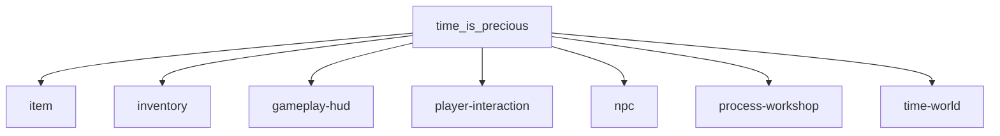
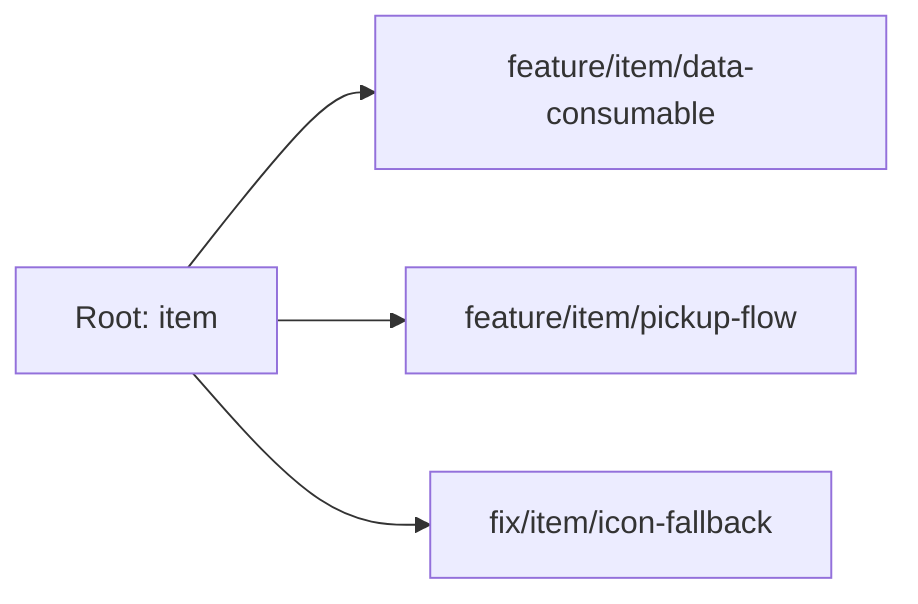

# Root and Branch Map

Dokumen ini adalah **peta teknis domain project**, bukan tracker progres development.

Untuk pertanyaan:

- **"Sekarang kita ada di tahap mana?"** -> buka `ROADMAP.md`.
- **"Apa yang sudah benar-benar selesai / merged?"** -> buka `DEVLOG.md`.
- **"Fitur ini masuk domain teknis mana?"** -> gunakan dokumen ini.
- **"Bagaimana sistem saling terhubung secara teknis?"** -> buka `ARCHITECTURE.md`.

Dokumen ini dipakai untuk membedakan tiga hal:

1. `Root` = domain fitur besar di project.
2. `Branch Git` = pekerjaan kecil yang diambil dari satu root.
3. `Commit scope` = label kecil agar riwayat Git tetap enak dibaca.

Prinsip utamanya: **branch bukan peta progres dan bukan peta arsitektur utama**. Branch dipakai untuk kerja pendek dan spesifik. Status aktif / selesai / backlog tidak ditentukan dari dokumen ini.

## Pohon Hierarki Teknis

```text
time_is_precious
|-- item
|   |-- data
|   |   |-- resources/items
|   |   `-- resources/item_data
|   |-- runtime
|   |   |-- scripts/autoload/item_database
|   |   `-- scripts/class/item_enums
|   |-- pickup
|   |   |-- pickup_item.gd
|   |   `-- scenes/pickup_item
|   `-- ui
|       `-- scenes/ui/item_slot
|
|-- inventory
|   |-- runtime
|   |   `-- scripts/autoload/inventory
|   |-- ui
|   |   |-- scenes/ui/inventory_ui
|   |   |-- scenes/ui/item_grid
|   |   `-- scenes/ui/item_slot
|   `-- content-link
|       `-- resources/items
|
|-- gameplay-hud
|   |-- ui
|   |   |-- scenes/ui/gameplay_hud
|   |   |-- scenes/ui/hud_shortcut_slot
|   |   `-- scenes/ui/hud_side_action
|   |-- theme
|   |   `-- resources/ui_gameplay_theme
|   `-- test-scene
|       `-- scenes/test_scenes/test_scene_feature_gameplay_hud
|
|-- player-interaction
|   |-- player
|   |   `-- scenes/player
|   |-- interactable
|   |   |-- scenes/components/interactable_component
|   |   `-- scenes/components/interactable_label_component
|   `-- input
|       `-- scripts/game_input_events
|
|-- npc
|   |-- base
|   |   `-- scenes/npc_base
|   |-- children
|   |   `-- scenes/npc_children
|   `-- data
|       |-- resources/npc_data
|       `-- resources/npc_states
|
|-- process-workshop
|   |-- process
|   |   |-- scripts/autoload/process_manager
|   |   `-- resources/process_data
|   |-- work
|   |   |-- scripts/autoload/work_manager
|   |   |-- scripts/class/work_order
|   |   `-- scripts/class/station_state
|   `-- workshop
|       |-- scenes/work_shop
|       `-- scripts/autoload/work_shop_storage
|
`-- time-world
    |-- time
    |   |-- scripts/autoload/time_component_manager
    |   `-- scenes/time_label
    `-- world-test
        `-- scenes/test_scenes
```

## Diagram Ringkas Root


```mermaid
flowchart TD
    Game["time_is_precious"]
    Game --> Item["item"]
    Game --> Inventory["inventory"]
    Game --> HUD["gameplay-hud"]
    Game --> Player["player-interaction"]
    Game --> NPC["npc"]
    Game --> Process["process-workshop"]
    Game --> Time["time-world"]
```

## Root Teknis Utama

| Root | Tujuan | File/folder utama | Contoh child branch |
| --- | --- | --- | --- |
| `item` | definisi item, icon, category, pickup, data item | `resources/items`, `resources/item_data`, `scripts/autoload/item_database`, `scenes/pickup_item`, `scenes/ui/item_slot`, `pickup_item.gd` | `feature/item/data-consumable` |
| `inventory` | penyimpanan item, kapasitas, grid, buka/tutup inventory | `scripts/autoload/inventory`, `scenes/ui/inventory_ui`, `scenes/ui/item_grid`, `scenes/ui/item_slot` | `feature/inventory/capacity-rule` |
| `gameplay-hud` | HUD utama, shortcut, quick consumable tray | `scenes/ui/gameplay_hud`, `scenes/ui/hud_shortcut_slot`, `scenes/ui/hud_side_action`, `resources/ui_gameplay_theme` | `feature/gameplay-hud/quick-consumable-tray` |
| `player-interaction` | movement, interact, input ke object dunia | `scenes/player`, `scenes/components/interactable_component`, `scenes/components/interactable_label_component`, `scripts/game_input_events` | `feature/player-interaction/interact-prompt` |
| `npc` | state NPC, data NPC, behavior turunan | `scenes/npc_base`, `scenes/npc_children`, `resources/npc_data`, `resources/npc_states` | `feature/npc/work-cycle` |
| `process-workshop` | process crafting/produksi dan sistem workshop | `scripts/autoload/process_manager`, `scripts/autoload/work_manager`, `scripts/autoload/work_shop_storage`, `resources/process_data`, `scenes/work_shop` | `feature/process-workshop/claim-flow` |
| `time-world` | waktu, cuaca, test scene dunia | `scripts/autoload/time_component_manager`, `scenes/time_label`, `scenes/test_scenes` | `feature/time-world/day-night-balance` |

> Catatan: tabel ini menunjukkan **lokasi teknis**, bukan status prioritas. Root yang ada di sini belum tentu sedang dikerjakan. Untuk prioritas aktual selalu cek `ROADMAP.md`.

## Aturan Naming Branch

Format yang disarankan:

```text
<type>/<root>/<child-work>
```

Contoh:

```text
feature/item/data-consumable
feature/item/pickup-flow
feature/inventory/ui-grid-refresh
feature/gameplay-hud/quick-consumable-tray
fix/inventory/slot-quantity-preview
refactor/item/database-loader
test/gameplay-hud/quick-slot-smoke-test
```

Aturan sederhana:

- `type` hanya satu dari: `feature`, `fix`, `refactor`, `chore`, `test`
- `root` harus nama domain, bukan nama file
- `child-work` harus satu fokus kerja
- satu branch sebaiknya hanya menyentuh satu root utama
- kalau pekerjaan menyentuh dua root, pilih root dominan lalu tulis root kedua di deskripsi PR

## Hubungan Root dan Branch

Contoh cara berpikir yang sehat:

- `item` bukan branch permanen, tapi root/domain.
- dari root `item`, kamu bisa membuat branch kecil seperti `feature/item/data-consumable`.
- setelah merge, branch dihapus, tetapi root `item` tetap hidup di dokumen ini.


```mermaid
flowchart LR
    Root["Root: item"] --> B1["feature/item/data-consumable"]
    Root --> B2["feature/item/pickup-flow"]
    Root --> B3["fix/item/icon-fallback"]
```

## Commit Convention

```text
feat(item): add consumable fatigue metadata
feat(inventory): refresh grid after item consume
feat(gameplay-hud): add quick consumable tray
fix(item): prevent duplicate item id registration
refactor(inventory): split capacity calculation helpers
```

Dengan model ini:

- `ROADMAP.md` menjawab progres dan prioritas
- dokumen ini menjawab domain teknis
- branch menjawab satu pekerjaan sementara
- commit menjawab perubahan kecil
- `DEVLOG.md` menyimpan hasil implementasi yang sudah benar-benar terjadi

## Cara Pakai Sehari-hari

1. Buka `ROADMAP.md` dan pilih **highest unfinished priority**.
2. Tentukan root teknis yang paling dominan dari pekerjaan itu menggunakan dokumen ini.
3. Pecah pekerjaan menjadi satu child work kecil.
4. Buat branch dengan format `<type>/<root>/<child-work>`.
5. Tulis commit dengan scope root yang sama.
6. Setelah merge, hapus branch.
7. Update `DEVLOG.md` jika implementasi menghasilkan milestone berarti.
8. Update `ROADMAP.md` hanya jika posisi, prioritas, atau phase gate benar-benar berubah.

## Yang Tidak Boleh Dilakukan

Jangan menulis status seperti `active`, `done`, atau `backlog` di dokumen ini sebagai sumber kebenaran progres.

Alasannya:

- status branch cepat basi
- pekerjaan bisa selesai tanpa struktur root berubah
- satu fitur dapat menyentuh beberapa domain teknis
- tracker ganda membuat `ROADMAP.md` dan root map mudah bertentangan

Jika butuh menjawab "apa yang aktif sekarang", gunakan `ROADMAP.md`.

## Template Fitur Baru

Kalau nanti menambah root baru:

```text
Root:
- farming

Child branches:
- feature/farming/soil-state
- feature/farming/seed-item-link
- feature/farming/harvest-feedback

Commit examples:
- feat(farming): add soil moisture state
- feat(farming): connect seed item to farm plot
- fix(farming): prevent double harvest
```

Tambahkan root ke dokumen ini hanya jika memang menjadi domain teknis yang berumur panjang, bukan hanya satu task sementara.
